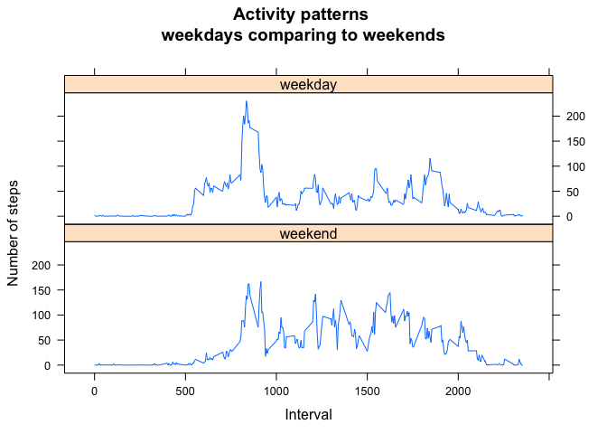

# Reproducible Research: Peer Assessment 1
<br>

## Loading and preprocessing the data
First of all, let us perform all those boring steps we need to begin our investigations. They include:  
1. checking the system, to choose method of downloading  
2. downloading the data, if it is not downloaded already  
3. reading the data  
4. installing necessary packages  


```r
Windows <- FALSE
if(Sys.info()["sysname"]=="Windows") Windows <- T

file.in.a.hole <- F
if("activity.csv" %in% dir()) file.in.a.hole <- T

if (!file.in.a.hole) {
    url.data.file <- "https://d396qusza40orc.cloudfront.net/repdata%2Fdata%2Factivity.zip"
    temp.zip.file.name <- "temp.zip"
    if(Windows) download.file(url.data.file, temp.zip.file.name) else
        download.file(url.data.file, temp.zip.file.name, method="curl")
    unzip(temp.zip.file.name)
    file.remove(temp.zip.file.name)
}

activity.data <- read.csv("activity.csv", header = T)

if(!("lattice" %in% installed.packages())) install.packages("lattice")
library(lattice)
```
<br>

## What is mean total number of steps taken per day?  
In this part of the assignment, we ignore the missing values in the dataset. We do following:  
1. Calculate the total number of steps taken per day  
2. Make a histogram (not barplot!) of the total number of steps taken each day  
3. Calculate and report the mean and median of the total number of steps taken per day  


```r
days<-aggregate(activity.data$steps,
                            by=list(Category=activity.data$date), FUN=sum, na.rm = T)
hist(days$x, 
     breaks = seq(0,22000,by=2000), 
     col = "lightblue", border = "blue",
     xlim = c(0,22000),
     axes = F,
     main = "Distributions of total number of steps \ntaken per day",
     xlab = "Number of steps",
     ylab = "Frequency")
axis(1, at = seq(0,22000,by=2000))
axis(2)
```

 

```r
mean(days$x, na.rm = T)
```

```
## [1] 9354.23
```

```r
median(days$x, na.rm = T)
```

```
## [1] 10395
```
The **mean** of the total number of steps taken per day equals **9 354**, when the **median** of the value equals **10 395**.  
<br>  

## What is the average daily activity pattern?  
Here we are going to do two things:  
1. Build the plot which shows the daily activity pattern as number of steps taken in 5 minutes interval, averaged across all days.  
2. Find the 5-minute interval, which contains the maximum number of steps.


```r
intervals <- aggregate(activity.data$steps,
                            by=list(Category=activity.data$interval), FUN=mean, na.rm = T)

plot(intervals$Category, intervals$x, type = "l",
     col = "blue",
     axes = F,
     main = "Average number of steps \ntaken per 5-minutes interval",
     xlab = "Time of a day",
     ylab = "Number of steps")
ticks <- substr(intervals$Category,
                nchar(intervals$Category)-1, nchar(intervals$Category)) == "00"
axis(1, at = intervals$Category[ticks],
     labels=format(intervals$Category[ticks], big.mark = ":", big.interval = 2L))
axis(2)
abline(v = intervals$Category[which.max(intervals$x)], col = "red")
```

 

```r
intervals$Category[which(intervals$x==max(intervals$x))]
```

```
## [1] 835
```
Red vertical line on a plot represents the 5-minutes interval, which contains the maximum number of steps. This interval starts at **8:35**.

## Imputing missing values

There are missing values in the data. The presence of missing days may introduce bias into some calculations or summaries of the data. That is why we will do the following:  
1. Calculate and report the total number of missing values in the dataset (i.e. the total number of rows with NAs)   
2. Create a new dataset that is equal to the original dataset but with the missing data filled in. For filling we use the mean for appropriate 5-minute interval to substitute NAs.  
3. Make a histogram of the total number of steps taken each day  
4. Calculate and report the mean and median total number of steps taken per day.   
5. Find the answers:    
    * Do these values differ from the estimates from the first part of the assignment?  
    * What is the impact of imputing missing data on the estimates of the total daily number of steps?    


```r
sum(is.na(activity.data$steps))
```

```
## [1] 2304
```
Total number of missing values is **2 304**.

Now let us create a new data set with all NAs replaced by mean of for appropriate 5-minute interval.

```r
full <- activity.data

for (n in 1:dim(full)[1]) {
    if (is.na(full$steps[n])) full$steps[n] <- intervals$x[which(intervals$Category == full$interval[n])]
}
head(full)
```

```
##       steps       date interval
## 1 1.7169811 2012-10-01        0
## 2 0.3396226 2012-10-01        5
## 3 0.1320755 2012-10-01       10
## 4 0.1509434 2012-10-01       15
## 5 0.0754717 2012-10-01       20
## 6 2.0943396 2012-10-01       25
```

```r
sum(is.na(full$steps))
```

```
## [1] 0
```

It is time for histogram (not a barplot) built on inputing data.

```r
full.days<-aggregate(full$steps,
                            by=list(Category=full$date), FUN=sum)

hist(full.days$x, 
     breaks = seq(0,22000,by=2000), 
     col = "lightblue", border = "blue",
     xlim = c(0,22000),
     axes = F,
     main = "Distributions of total number of steps \ntaken per day",
     xlab = "Number of steps",
     ylab = "Frequency")
axis(1, at = seq(0,22000,by=2000))
axis(2)
```

 

The mean and median of imputing data are:


```r
mean(full.days$x)
```

```
## [1] 10766.19
```

```r
median(full.days$x)
```

```
## [1] 10766.19
```

They are equal to each other! Coincidence? Not at all. There are 8 days in the data set with all 5-minutes interval marked as NA. It is obvious that after inputing the data all of them will be equal to each other and at the same time equal to the mean of total number of steps. Here is the grimace of artificial data!

Now we are ready to answer the question of the 5th point:  
    * Yes, these values differ from the estimates from the first part of the assignment  
    * Total number of steps is increased: **570 608** VS **656 737.5**. If we are talking about mean it is also increased **9 354.23** VS **10 766.19**


## Are there differences in activity patterns between weekdays and weekends?
<br>


Let us compare the activity in weekdays and weekends. To do this we will perform following steps:  

1. Create a new factor variable in the dataset with two levels – “weekday” and “weekend” indicating whether a given date is a weekday or weekend day.  
2. Make a panel plot containing a time series plot of the 5-minute interval (x-axis) and the average number of steps taken, averaged across all weekday days or weekend days (y-axis).  


```r
full$date <- as.Date(full$date)
working.days <- c('Monday', 'Tuesday', 'Wednesday', 'Thursday', 'Friday')
full$wDay <- factor((weekdays(full$date) %in% working.days), levels=c(FALSE, TRUE), labels=c('weekend', 'weekday'))

j <- aggregate(full$steps, by=list(Category=full$interval, full$wDay), FUN=mean, na.rm = T)

xyplot(j$x~j$Category|j$Group.2, type="l", main="Activity patterns \nweekdays comparing to weekends", xlab="Interval", ylab="Number of steps", layout=c(1,2))
```

 

Thus we have answered all the questions of the assessment.
